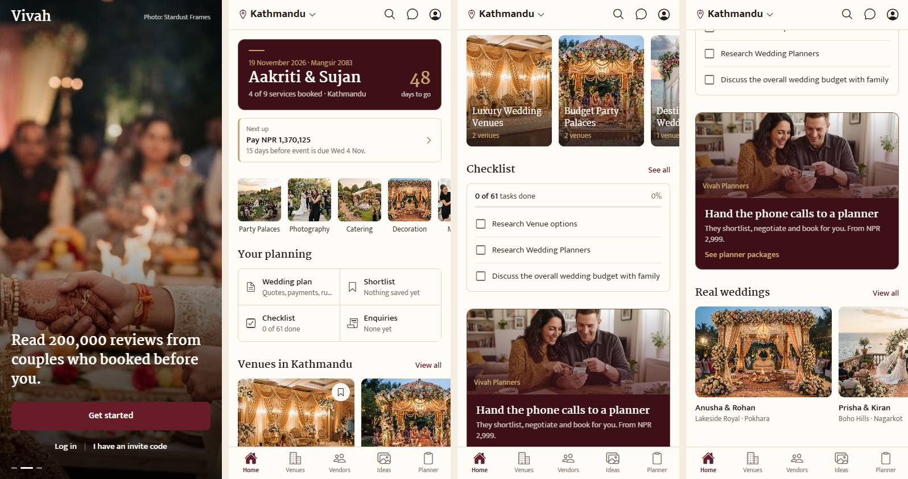
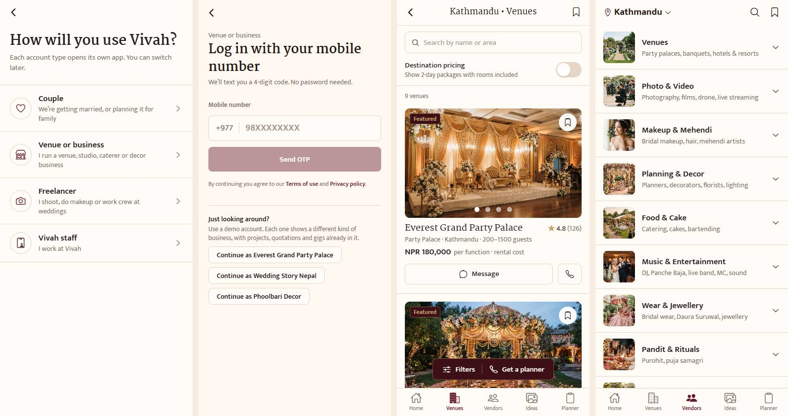
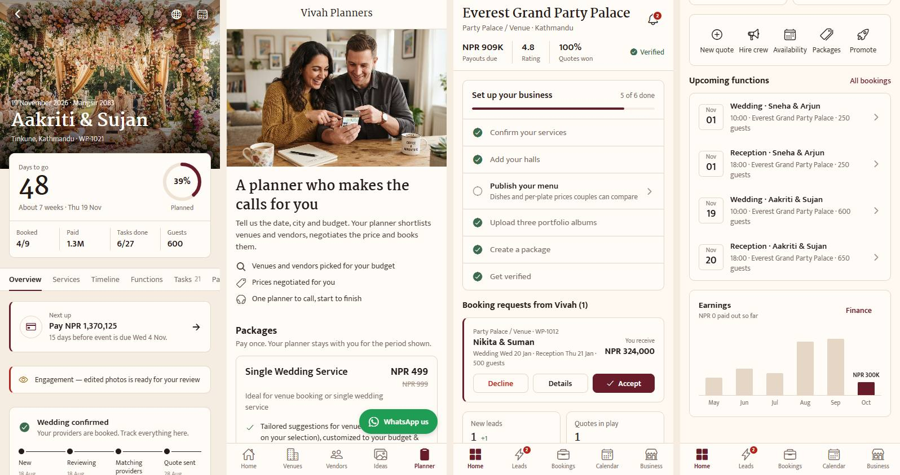
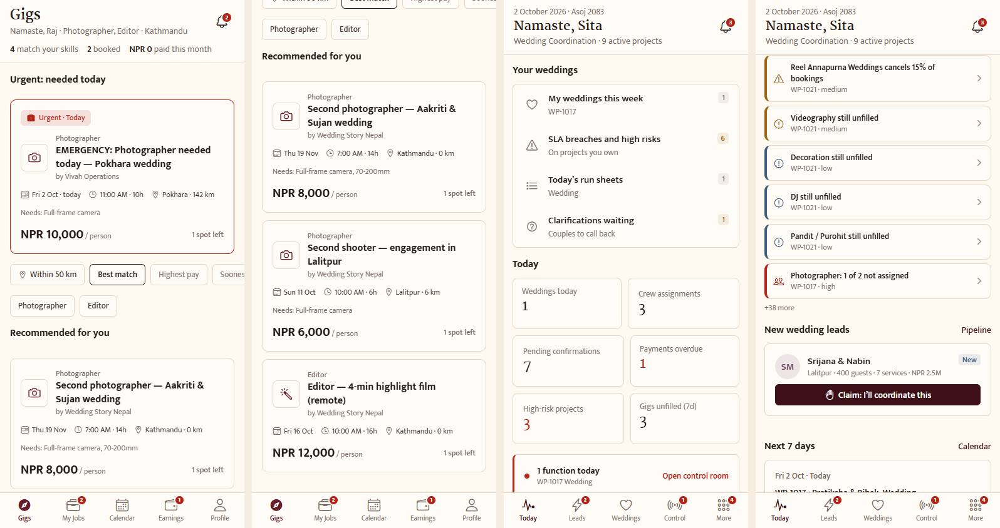

# Vivah UI/UX report: luxury redesign status and roadmap

_Written 2 October 2026, after PR #20 (Royal Nepali Luxury palette) merged into `main`._

This report covers what has been done to the look and feel of Vivah, how the app holds up today, and a prioritised list of what to do next to make it more beautiful, more luxurious and easier to use. Every finding points at a file, so each one can become a small PR.

**How it was reviewed**

- Code audit of `src/` (tokens, components, every screen that sets colour, type or motion).
- Screenshots of all four role apps at phone width (390 px) in Edge, taken on the luxury branch. They are in [`docs/ui-ux-report/`](ui-ux-report/).
- WCAG 2.1 contrast ratios computed for every pair in the palette.
- Checklists from the `ui-ux-pro-max` skill (React Native stack rules, pro-rules pre-delivery checklist) and the `design-critique` framework.
- The skill's generated "design system" for a luxury wedding marketplace proposed navy and blue, Liquid Glass and a script font (Great Vibes). That clashes with the brand and the no-AI-look rules in `AGENTS.md`, so it was rejected; only its checklists were used.

---

## 1. Summary

Vivah now reads as a premium Nepali wedding brand: ivory paper, burgundy and wine anchors, a thin line of champagne gold, and Martel serif titles. The couple home is the strongest screen. The four apps are visually unified.

The gap between "nicely coloured" and "luxurious" is now mostly **finish and craft**, not colour:

1. **Accessibility debt** that the palette exposed: 43 places use a text colour that fails contrast, inputs and toggles have near-invisible borders, text scaling is capped and nothing respects Reduce Motion.
2. **Inconsistency between the couple app and the three work apps**: the work apps still use sans-serif section titles, ad-hoc filter chips that select in espresso instead of burgundy, and a tab bar with no gilt detail.
3. **Missing luxury craft**: no image placeholders (photos pop in), almost no motion between screens, no dark mode, and stock photography doing a lot of the work.

| Area | Today | Target |
| --- | --- | --- |
| Brand and colour | 8/10 | 9/10 after the quick wins |
| Typography | 7/10 | 9/10 with serif everywhere titles appear and better numerals |
| Consistency across apps | 6/10 | 9/10 |
| Accessibility | 5/10 | 8/10 |
| Motion and feedback | 5/10 | 8/10 |
| Imagery | 6/10 | 9/10 with placeholders and real vendor photos |

---

## 2. What has been done

### 2.1 Earlier redesign (PRs #3 and #4, September 2026)

Removed the "AI-generated" look:

- One type system: Mukta for UI, Martel for display. Both have Devanagari, so Nepali sets in the same voice.
- No gradients except photo scrims, no glows or coloured shadows, cards with a 1 px border and 10 px radius.
- Sentence case everywhere, no emoji in UI chrome, no sparkle or "AI" language ("Quick help", "Vivah Planners").

### 2.2 Royal Nepali Luxury palette (PR #20, merged 2 October 2026)

| Role | Token | Hex | Contrast on ivory |
| --- | --- | --- | --- |
| Primary, deep burgundy | `primary` | #681C2A | 11.2 : 1 |
| Primary dark, wine | `wine`, `primaryDark` | #3D1018 | — |
| Accent, champagne gold | `gold` | #C8A46B | 2.2 : 1 (decoration only) |
| Gold for text | `goldDeep` | #8C6A33 | 4.8 : 1 |
| Background, warm ivory | `bg` | #FFF9F2 | — |
| Surface, pearl cream | `bgSoft` | #F5ECE2 | — |
| Romantic accent, dusty rose | `rose` | #C98991 | 2.7 : 1 (decoration only) |
| Ink, espresso | `heading` | #251B18 | 16.1 : 1 |
| Muted, warm taupe | `textMuted` | #796B64 | 4.9 : 1 |
| Soft white | `white` | #FFFCF8 | — |

What changed:

- **Tokens.** `src/constants/theme.ts` and `src/theme/roles.ts` carry the palette, so every screen that used tokens changed at once. Couple, business and freelancer apps share burgundy; the staff console uses wine. `ROLE_MARK` keeps senders distinguishable in chat.
- **Luxury sections.** The home wedding strip is a wine card with the date, countdown and a short gilt rule in champagne. The planner promo, "Featured" badges and the floating filter bar are wine with gold hairlines. Collection captions are champagne over espresso scrims.
- **Typography.** Martel for screen titles, section titles, venue and vendor names, and dashboard figures.
- **Controls.** Selected chips turn burgundy instead of ink.
- **Brand assets.** App icon, Android adaptive icon, splash and favicon are burgundy with champagne rings. Printable quotations and receipts use the same palette with a serif heading.
- **From PR #19.** Announcement banners and the impersonation pill use palette tokens; the new vehicles service group has a warm background.
- **Documentation.** `AGENTS.md` §8 "Visual design" holds the palette table and the 65 / 20 / 10 / 5 distribution rule.

Screens after the change:

---

## 3. Design critique

### 3.1 First impression

The welcome carousel and couple home feel premium: a full-bleed photo, a serif headline, one burgundy button, then a wine card with the couple's names and a champagne countdown. The eye lands on the couple's names first, which is right for a wedding app.

The work apps (business, freelancer, staff) feel calmer and more utilitarian. That is right for tools people use all day, but today they look like a different product because they miss the serif section titles and gilt details.

### 3.2 What works well

- **Restraint.** Gold is used as a line, never a fill, so it reads as metal rather than mustard.
- **The wine card on home.** It carries the 20% burgundy share without making the whole screen dark.
- **Serif titles.** Martel instantly makes lists and headers feel editorial.
- **One accent per screen.** Every screen has a single obvious primary action.
- **Status colours** (success, warning, danger) all pass 4.5 : 1 on ivory and stay distinct from burgundy.

### 3.3 Usability findings

| Finding | Severity | Recommendation |
| --- | --- | --- |
| 43 text elements use `colors.textSubtle` / `t.c.subtle` (#A39388, 2.8 : 1 on ivory). Fails WCAG AA for normal text. | Critical | Use `textSubtle` only for icons and disabled states. Move text to `textMuted` (4.9 : 1), or darken `textSubtle` to about #8F7F74. |
| `textMuted` on pearl cream (`bgSoft`) is 4.4 : 1, just under 4.5. Used on filter rows and pressed rows. | Moderate | Darken `textMuted` slightly (#6F625B gives about 5.1 : 1 on pearl), or avoid muted text on pearl. |
| Input, toggle and outline-button borders use `colors.border` (#E5D6C5, 1.4 : 1). WCAG asks 3 : 1 for control boundaries. Inputs on ivory are hard to find for older users. | Moderate | Add a `borderStrong` token (around #B9A48E) for inputs, toggles and outline buttons; keep the soft border for cards. Files: `src/components/ui/Field.tsx:65`, `src/components/ui/Toggle.tsx`, `src/components/ui/Button.tsx`. |
| `Text` caps font scaling at 1.3× (`src/components/ui/Text.tsx:61`). Users with large system text get a smaller app than they asked for. | Moderate | Raise to 1.6–2.0 and fix the few layouts that break (tab labels, KPI tiles). |
| No screen checks Reduce Motion. The welcome carousel auto-advances every 4.5 s (`src/app/welcome/index.tsx:46`) with no pause control. | Moderate | Use Reanimated's `useReducedMotion()`; stop autoplay and skip entering animations when it is on. Add a pause on tap. |
| 102 text elements are 9–11 px (91 at 11 px, mostly tab labels and meta lines). | Minor | Keep tab labels at 11 but make all other meta text 12 px minimum. |
| The green "WhatsApp us" floating pill on the planner screen (`src/components/genie/GenieSections.tsx:186`) is the loudest thing on a luxury page. | Minor | Wine pill with a small green WhatsApp glyph, or soft-white pill with a gold border. |

### 3.4 Visual hierarchy

- **Couple app:** clear. Names, then next action, then categories, then curated content.
- **Business and staff dashboards:** the KPI tiles, the setup checklist and the request cards all sit at the same weight, so nothing leads. Give the one most urgent item (a booking request, an overdue payment) a wine band or a burgundy left rule, like "Next up" on the couple home.
- **Vendors tab:** a plain list of ten categories with small square photos. It is the least luxurious screen in the couple app. Turn it into an editorial grid: two columns of tall photo cards with serif captions, or a hero category plus a grid.

### 3.5 Consistency

| Element | Issue | Recommendation |
| --- | --- | --- |
| Section titles in work apps | `SectionTitle` in `src/components/kit/primitives.tsx:143` is Mukta bold; couple `SectionHeader` is Martel. | Make `SectionTitle` serif to match. |
| Filter chips in work apps | Screens build their own chips; freelancer sort chips select in espresso (`src/app/freelancer/(tabs)/index.tsx:115-122`). Couple `Chip` selects in burgundy. | Replace ad-hoc chips with the shared `Chip`, or add a kit `FilterChip` with the same selected style. |
| Tab bars | Active state is colour only (`src/components/navigation/TabBar.tsx:53`, `RoleTabBar.tsx:124`). | Add a 2 px champagne bar above the active tab and a soft-white bar with a gold hairline on top. Also helps colour-blind users (state not by colour alone). |
| Avatars | `AVATAR_COLORS` (`src/components/kit/primitives.tsx:115`) still uses the old pine, slate and moss. | Use palette tones: burgundy, wine, goldDeep, deep rose (#8E4F58), taupe, espresso. |
| Hard-coded colours | 78 hex literals remain in 20 `.tsx` files. Most are legitimate (website and invitation themes, payment brand colours, QR backgrounds), but some are not. | Add an ESLint rule (`no-restricted-syntax` on hex strings in `src/components` and `src/app`, with an allow-list for theme files and user-chosen themes). |
| Icon sizes | `Ionicons` use 20 different sizes between 11 and 44 px (most common 18, 20, 22, then 14, 16, 15, 13, 19, 12…). | Define `iconSize = { xs: 14, sm: 16, md: 20, lg: 24 }` tokens and snap to them. |

---

## 4. Roadmap

Effort: S = under half a day, M = 1–2 days, L = about a week.

### 4.1 Quick wins (do first, about one PR each)

| # | Change | Why | Effort | Files |
| --- | --- | --- | --- | --- |
| 1 | Fix text contrast: retire `textSubtle` for text, nudge `textMuted` darker | Accessibility, readability for parents and grandparents | S | `src/constants/theme.ts`, 43 call sites |
| 2 | `borderStrong` token for inputs, toggles, outline buttons | Controls become findable; meets 3 : 1 | S | theme, `Field`, `Toggle`, `Button`, `SearchBar` |
| 3 | Gilt tab bar: champagne indicator over the active tab, gold hairline on top | The most-seen piece of chrome becomes luxurious | S | `TabBar.tsx`, `RoleTabBar.tsx` |
| 4 | Serif `SectionTitle`, palette avatars, shared filter chip | Work apps match the couple app | S | `kit/primitives.tsx`, freelancer and platform screens |
| 5 | Image placeholders: `placeholder` (blurhash or a pearl colour) and `transition={200}` on every `expo-image` | Photos fade in instead of popping; feels expensive | S | 56 `<Image>` usages, start with `MiniCards`, `VenueCard`, `ImageCarousel` |
| 6 | Reduce Motion support and a pause control on the welcome carousel | Accessibility; respects user settings | S | `welcome/index.tsx`, a shared `useMotion()` hook |
| 7 | WhatsApp pill restyle on the planner page | Removes the one off-palette element on a sales page | S | `GenieSections.tsx` |
| 8 | Lint rule against new hex literals outside tokens | Keeps the palette from drifting | S | `eslint.config.js` |

### 4.2 Next (makes it feel crafted)

| # | Change | Why | Effort |
| --- | --- | --- | --- |
| 9 | **Motion system.** Shared timing tokens (fast 150 ms, base 240 ms, slow 360 ms, one ease-out curve). Fade-and-rise on section entry; shared-element transition from venue card photo to venue detail hero (Reanimated `sharedTransitionTag`); spring on shortlist heart. One or two moving things per screen. | Luxury apps feel smooth and deliberate; today most changes are instant | M |
| 10 | **Editorial Vendors tab.** Two-column photo grid with serif captions and a featured category hero. | The weakest couple screen today | M |
| 11 | **Venue and vendor detail pages.** Full-bleed hero gallery with page dots in champagne; serif name; a sticky bottom bar on soft white with price on the left and a burgundy "Check availability" on the right; "Verified by Vivah" seal in goldDeep; reviews with photos. | Detail pages are where couples decide; they should feel like a brochure | M |
| 12 | **Dashboard hierarchy in work apps.** One "needs you now" card on wine at the top of each dashboard; KPI tiles below in a quieter style. | Today everything has equal weight | M |
| 13 | **Ornament, used sparingly.** A small Dhaka or toran-inspired line motif as an SVG divider, used only at the top of the wedding card, the quotation PDF and the invitation. | A Nepali signature no template has; keep it to two or three places | S–M |
| 14 | **Numerals.** Use Martel for every money figure and countdown; tabular figures in tables (`fontVariant: ['tabular-nums']`). | Prices are the most-read text in the app | S |
| 15 | **Empty states with character.** Replace generic icons with small line illustrations in burgundy and gold (mandap, marigold garland, kalash). | Empty screens are common for new couples and vendors | M |
| 16 | **Lists.** Move long lists (gigs, leads, guests) to FlashList; add skeletons where they are missing. | Smooth scrolling on mid-range Android phones common in Nepal | M |

### 4.3 Bigger bets

| # | Change | Why | Effort |
| --- | --- | --- | --- |
| 17 | **Dark mode, "Wine night".** Wine #3D1018 and a deeper #260A0F as surfaces, soft-white text, champagne accents. The token layer already supports it (`RoleTheme.dark`). Check every pair for 4.5 : 1 separately; do not reuse light values. | Expected by premium users; looks spectacular with gold | L |
| 18 | **Photography.** Replace the 24 stock photos with commissioned or vendor-supplied Nepali wedding photos, colour-graded warm. Add an upload guide for vendors (aspect ratios, minimum size). | Imagery does half the luxury work; stock photos make it generic | L (mostly non-code) |
| 19 | **Wordmark and icon.** A proper "Vivah" wordmark in Martel with a Devanagari companion (विवाह), and a refined ring mark. Use it on splash, welcome and documents. | Today the brand is the word "Vivah" in the body serif | M (design) |
| 20 | **"Vivah Signature" tier.** A curated premium tier of venues and vendors with a gold seal, a dedicated collection on home and a concierge call-back. | Luxury is also about curation, not only colour | L (product) |
| 21 | **Nepali typography pass.** With Nepali now in the app (PR #19), check line heights, truncation and numerals in Devanagari for every screen. | Nepali text is taller; serif titles may clip | M |
| 22 | **Tablet and desktop polish** for business and staff apps: max content width, two-pane layouts. | The sidebar exists; content still stretches | M |

---

## 5. Pre-delivery checklist for every future UI PR

From the `ui-ux-pro-max` pro-rules, adapted to Vivah:

- [ ] Colours come from tokens; no new hex in screens.
- [ ] Text contrast at least 4.5 : 1 (3 : 1 only for text 18 px and larger); control borders at least 3 : 1.
- [ ] Gold is never body text on ivory (use `goldDeep`); rose is never text.
- [ ] Every tappable element gives pressed feedback within about 100 ms and is at least 44 × 44 pt (use `hitSlop` for small icons).
- [ ] Icon-only buttons have an `accessibilityLabel`; selected and expanded states are announced.
- [ ] Works with the largest system text size and with Reduce Motion on.
- [ ] Nothing hides behind the notch, the tab bar or the home indicator.
- [ ] Checked at 375 px, a large phone, and desktop width for the business and staff apps.
- [ ] Checked in Nepali as well as English.
- [ ] Sentence case, no emoji in chrome, no "AI" language (`AGENTS.md` §8).

---

## 6. Status after the 3 October 2026 pass

The finish-and-craft pass worked through the roadmap at the component level, so every screen of all four apps changed at once, then redesigned the screens the report singled out. Before and after screenshots were taken of 29 screens at 390 px and 1280 px.

| # | Item | Status | Where |
| --- | --- | --- | --- |
| 1 | Text contrast | **Done.** `textMuted` #6F625B (5.6 : 1 ivory, 5.0 : 1 pearl); `textSubtle` #8F7F74 kept for icons, disabled states and large numbers; the 54 places that set small text in it now use `textMuted`. `warning` (#8A5A10) and `goldDeep` (#7F5F2C) deepened so pills on their own tint pass 5 : 1 | `constants/theme.ts` |
| 2 | `borderStrong` | **Done**, at #9F8A75: the report's suggested #B9A48E measures only 2.3 : 1, this is 3.2 : 1. Inputs, search, toggles, outline and secondary buttons; focus is a 2 px burgundy border | `Field`, `KField`, `SearchBar`, `Toggle`, `Button`, `KButton`, `Dialog` |
| 3 | Gilt tab bar | **Done.** Champagne hairline on top, animated champagne `TabMark` over the active tab; the sidebar marks its active item down the left edge and shows counts as pills | `navigation/TabMark.tsx`, `TabBar`, `RoleTabBar` |
| 4 | Serif `SectionTitle`, palette avatars, shared filter chip | **Done.** `FilterChip` replaces the freelancer feed's hand-built chips; `ChoiceChips` selects in burgundy | `kit/primitives.tsx`, `kit/controls.tsx` |
| 5 | Image placeholders | **Done.** `ui/Photo` (pearl placeholder, cross-dissolve) now renders every photo | 48 files |
| 6 | Reduce Motion, carousel pause | **Done.** `hooks/useMotion`; the welcome slideshow starts paused under Reduce Motion and has a pause/play button | `welcome/index.tsx` |
| 7 | WhatsApp pill | **Done.** Wine pill with a gold hairline and a small WhatsApp mark on soft white | `GenieSections.tsx` |
| 8 | Hex lint rule | **Done.** `no-restricted-syntax` in `eslint.config.js`; allow-list: website and invitation themes, payment brands. The other stray hex values became tokens | `eslint.config.js` |
| 9 | Motion system | **Partly.** Timing tokens (`motion`), one ease-out curve, `enter`/`fade`, the tab mark, the Vendors entrance. Shared-element transitions and the heart spring are still open | `hooks/useMotion.ts` |
| 10 | Editorial Vendors tab | **Done.** Serif intro, featured category, 2/3/4-column photo grid with Martel captions over a wine scrim, services in a sheet | `(tabs)/vendors.tsx` |
| 11 | Detail pages | **Partly.** Champagne page dots on every photo carousel; the sticky price bar already existed. "Verified by Vivah" seal and review photos still open | `ImageCarousel.tsx` |
| 12 | Dashboard hierarchy | **Done** for business and staff: `FocusBand` leads with the one urgent thing (first booking request or new enquiries; weddings live today). The business home is two columns on desktop | `kit/dashboard.tsx` |
| 13 | Ornament | **Partly.** `ui/Ornament` on the home wedding band, the welcome headline, the Vendors feature and `FocusBand`. The quotation PDF and invitation are still open | `ui/Ornament.tsx` |
| 14 | Numerals | **Done** in the components: `<Text numeric>` (tabular figures) on KPI and stat figures, pills, key-value rows, countdown and focus-band amounts | `ui/Text.tsx` |
| 15 | Empty states with character | **Done.** Pearl medallion with a champagne ring on every empty state; five line drawings (mandap, marigold garland, kalash, diya, rings) on the couple's first-run lists | `ui/Illustration.tsx`, `EmptyState`, `EmptyBlock` |
| 16 | FlashList, skeletons | Open | |
| 17 | Dark mode | Open | |
| 18 | Photography | Open (non-code) | |
| 19 | Wordmark | **Partly.** Devanagari "विवाह" under "Vivah" on the welcome screen and a gilt rule under the sidebar brand | |
| 20 | Signature tier | Open (product) | |
| 21 | Nepali typography | Open; every new string has its Nepali line | |
| 22 | Tablet and desktop | **Partly.** Business home main column + side rail; Vendors grid widens to 3 and 4 columns | |

Also fixed: Guests & RSVP broke "Attending" mid-word at phone width (new `StatTile`, also used by Seating and Registry); text follows the system size up to 1.6× (was 1.3×); dialog, toast and sheet use palette tokens only; screen and section titles are announced as headers.

## Appendix: contrast of palette pairs

| Pair | Ratio | Use |
| --- | --- | --- |
| Espresso on ivory | 16.1 | Pass, all text |
| Soft white on burgundy | 11.5 | Pass, buttons |
| Burgundy on ivory | 11.2 | Pass, links and headings |
| Burgundy on primary soft | 9.4 | Pass |
| Gold on wine | 7.0 | Pass, text on wine sections |
| Danger on ivory | 6.3 | Pass |
| Success on ivory | 5.9 | Pass |
| Taupe (`textMuted`, now #6F625B) on ivory | 5.6 | Pass |
| Warning (now #8A5A10) on ivory | 5.7 | Pass; 5.0 on its own pill tint |
| Gold deep (now #7F5F2C) on ivory | 5.6 | Pass; 5.0 on pearl |
| Taupe on pearl | 5.0 | Pass (was 4.4 before the 3 Oct pass) |
| Text subtle (now #8F7F74) on ivory | 3.7 | Icons, disabled states and large numbers only |
| Dusty rose on ivory | 2.7 | Decoration only |
| Placeholder (now #8E7F75) on soft white | 3.8 | Placeholders are exempt; raised from 2.7 |
| Soft white on gold | 2.3 | Never use; put wine text on gold instead (7.0) |
| Gold on ivory | 2.2 | Decoration only |
| Border on ivory | 1.4 | Cards only |
| Border strong (#9F8A75) on ivory | 3.2 | Inputs, toggles, outline buttons |
